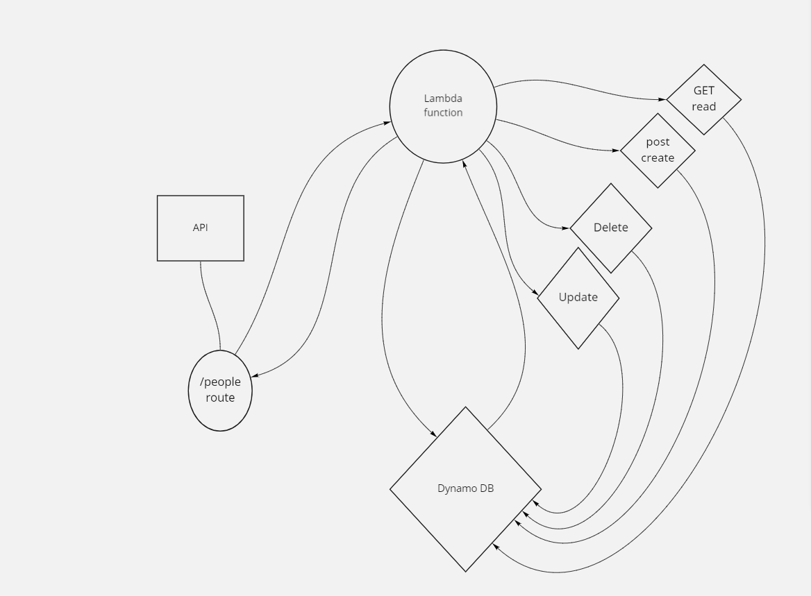

# serverless-REST-API

### Lab: AWS: API, Dynamo and Lambda

### overview 
- Create a single resource REST API using a domain model of your choosing, constructed using AWS Cloud Services.

### Describe and Define
- AWS API Gateway
- How to trigger Lambda Functions in response to an API request

### Execute
- Creation of a DynamoDB Table
- Creation of a Lambda function that can operate on a DynamoDB Table

#### Checklist
- IAM User role with access to Lambda and DynamoDB Full Access
- Dynamo DB Table Created
- Lambda function(s) that use Dynamoose to attach to the table
- Created with the correct IAM Role (Step 1)
- API Endpoints that all the appropriate functions for each action type

#### Creating a Dynamo DB Table at AWS
- Open the DynamoDB Dashboard
- Choose Create Table
- Name your table
- Choose a field name to use as primary key
-  install dynamoose as a dependency

### Create API Endpoints
- At API Gateway, create a new HTTP API
- Once created, define a route endpoint for each REST method
- Connect each endpoint to a lambda
- As your routes are invoked by users, those lambda's will fire, with the event receiving any POST or QUERY data.

#### set up
- *npm init -y*
- *npm install dynamoose* -daynamo library 
- *npm install uuid* - id gnerator
- *zip -r function.zip* - to zip my function 

